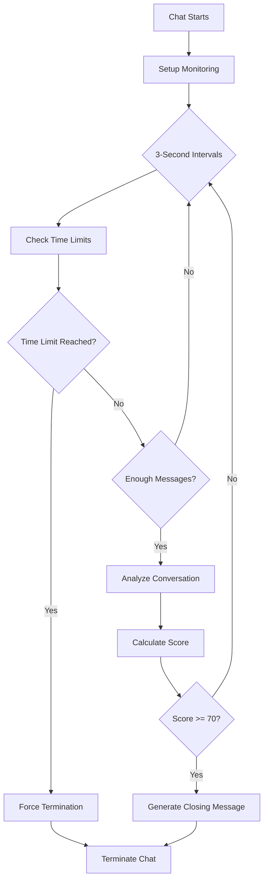

# Automatic Chat Termination System

## Overview

The Automatic Chat Termination system is a sophisticated feature designed to intelligently determine when a conversation between a student and Buddy (AI mental health companion) should naturally conclude. This system ensures that conversations are meaningful, productive, and don't drag on unnecessarily, while respecting the emotional needs of the student.

## How It Works

### Core Components

1. **Conversation Analyzer** (`src/services/conversation-analysis.ts`)
2. **Automatic Chat Termination** (`src/services/chats/automatic-chat-termination.ts`)
3. **Integration Point** (Used in chat hooks and components)

### Termination Triggers

The system uses two primary termination mechanisms:

#### 1. Time-Based Termination
- **Maximum Session Duration**: Configurable (default: 12 hours)
- **Warning Time**: Configurable (default: 1 minute before end)
- **Environment Variables**:
  - `CHAT_SESSION_DURATION_MINUTES`: Maximum session length
  - `CHAT_WARNING_TIME_MINUTES`: When to show time warnings

#### 2. Conversation-Based Termination
- **Minimum Messages**: Requires at least 5 messages before analysis
- **Completion Score**: Threshold of 70% to trigger termination
- **Analysis Interval**: Checks every 3 seconds after initial messages

## Conversation Analysis Algorithm

### Scoring System (0-100 points)

| Factor | Points | Description |
|--------|--------|-------------|
| Message Count | 30 | 10+ messages (20 pts), 20+ messages (10 pts) |
| Ending Indicators | 25 | Student expresses gratitude/satisfaction |
| Resolution | 20 | Student shows understanding/action plan |
| Conversation Depth | 15 | Deep, reflective conversation |
| Engagement Level | 10 | High student participation |
| Emotional Progress | 10 | Positive emotional change |
| Complete Resolution | 15 | Full problem resolution |

### Ending Indicators Detected

The system looks for natural ending phrases:
- "thank you", "thanks", "feel better", "helped me"
- "understand now", "clear", "resolved", "goodbye"
- "i feel better", "that makes sense", "i understand"
- "that helps", "good advice", "will try that"
- "feel supported", "feel heard", "appreciate this"
- "thanks for listening", "feel more hopeful"

### Resolution Indicators

- "i feel better", "that makes sense", "i understand"
- "that helps", "good advice", "will try that"
- "feel more confident", "know what to do", "have a plan"
- "feel ready", "feel prepared", "can handle this"

## Conversation Quality Assessment

### Depth Analysis
- **Shallow**: Short, surface-level messages (< 50 chars avg)
- **Moderate**: Medium-length messages (50-100 chars avg)
- **Deep**: Long, reflective messages (> 100 chars avg with "I feel/think/realize")

### Engagement Levels
- **Low**: < 4 student messages
- **Medium**: 4-7 student messages
- **High**: 8+ student messages

### Resolution Status
- **None**: No resolution indicators
- **Partial**: Some understanding or action plan
- **Complete**: Full resolution with deep conversation

## Implementation Details

### Key Methods

#### `shouldTerminateChat(messages, sessionId, sessionStartTime?)`
Analyzes conversation and returns termination decision with reason.

#### `setupTerminationCheck(getMessages, sessionId, onTerminate, sessionStartTime?)`
Sets up continuous monitoring with configurable intervals.

#### `generateClosingMessage(analysis)`
Creates empathetic, context-aware closing messages.

### Configuration

```typescript
// Configure session duration
AutomaticChatTermination.configureSessionDuration(
  maxDurationMinutes: number,
  warningTimeMinutes: number
);

// Get current configuration
const config = AutomaticChatTermination.getConfiguration();
```

### Integration Example

```typescript
// In chat hook
const cleanup = AutomaticChatTermination.setupTerminationCheck(
  () => messages,
  sessionId,
  (result) => {
    if (result.shouldTerminate) {
      // Handle termination
      endChat();
      generateSummary();
    }
  },
  sessionStartTime
);

// Cleanup on unmount
useEffect(() => cleanup, []);
```

## Termination Process Flow



## Closing Message Generation

The system generates personalized closing messages based on:

### Base Components
- "I'm really glad we could talk today."
- "It's been meaningful to connect with you."
- "Thank you for sharing this with me."
- "I appreciate your openness in our conversation."

### Progress Additions
- "I can see you've made some real progress, and that's wonderful to see."
- "You seem to have found some clarity and direction."
- "You've taken some important steps forward."

### Encouragements
- "Remember to be gentle with yourself as you process this."
- "Trust in your ability to handle what comes next."
- "You have more strength than you realize."
- "Take care of yourself and know I'm here if you need to talk again."

## Safety and Edge Cases

### Preventing Early Termination
- Minimum 5 messages required for conversation analysis
- Time-based checks always run regardless of message count
- Error handling prevents crashes

### Natural Ending Detection
- Checks for natural conversation conclusion patterns
- Respects student emotional state
- Provides graceful exit opportunities

### Error Handling
- Graceful fallback if analysis fails
- Continues monitoring despite errors
- Logs detailed debugging information

## Monitoring and Debugging

### Console Logs
The system provides detailed logging:
- `[AutoTermination]` prefix for all termination-related logs
- Session duration tracking
- Analysis results and decisions
- Interval management

### Key Metrics Tracked
- Message count and analysis frequency
- Session duration and time warnings
- Completion scores and termination reasons
- Error conditions and recovery

## Best Practices

### For Developers
1. Always call the cleanup function to prevent memory leaks
2. Handle termination callbacks gracefully
3. Monitor console logs for debugging
4. Configure appropriate session durations

### For Users
1. Natural conversation endings are preferred
2. Time limits ensure resource management
3. Emotional progress is prioritized
4. Students can always start new conversations

## Configuration Examples

### Short Sessions (Testing)
```typescript
AutomaticChatTermination.configureSessionDuration(5, 1); // 5 min max, 1 min warning
```

### Standard Sessions (Production)
```typescript
AutomaticChatTermination.configureSessionDuration(15, 3); // 15 min max, 3 min warning
```

### Extended Sessions (Therapy)
```typescript
AutomaticChatTermination.configureSessionDuration(60, 10); // 60 min max, 10 min warning
```

## Future Enhancements

### Planned Improvements
1. **AI-Powered Analysis**: Use language models for better conversation understanding
2. **Emotional State Tracking**: Monitor emotional progression more accurately
3. **Personalized Thresholds**: Adapt to individual student patterns
4. **Integration with Summaries**: Better coordination with summary generation

### Potential Extensions
1. **Multi-Session Context**: Consider conversation history across sessions
2. **Crisis Detection**: Enhanced safety monitoring
3. **Student Preferences**: Allow customization of termination behavior
4. **Analytics Dashboard**: Track termination patterns and effectiveness

## Troubleshooting

### Common Issues

1. **Early Termination**: Check minimum message requirements and scoring thresholds
2. **No Termination**: Verify session duration settings and analysis intervals
3. **Memory Leaks**: Ensure cleanup functions are called properly
4. **Missing Logs**: Check console for error messages and debugging info

### Debug Mode
Enable detailed logging by checking browser console for `[AutoTermination]` prefixed messages.

---

This system ensures that conversations with Buddy are meaningful, time-appropriate, and emotionally supportive while maintaining system efficiency and user safety.
