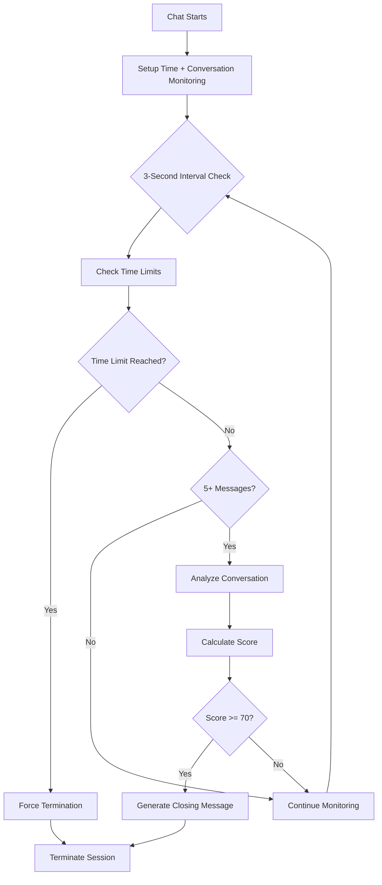

# Time-Based vs Conversation-Based Termination

## Overview

The Automatic Chat Termination system uses two complementary approaches to determine when a conversation should end: Time-Based Termination (hard limits) and Conversation-Based Termination (intelligent analysis).

---

## ⏰ Time-Based Termination

### Purpose
Ensures conversations don't run indefinitely, managing system resources and providing therapeutic structure.

### Configuration

#### Environment Variables
```bash
CHAT_SESSION_DURATION_MINUTES=720    # Default: 12 hours
CHAT_WARNING_TIME_MINUTES=1        # Default: 1 minute warning
```

#### Programmatic Configuration
```typescript
AutomaticChatTermination.configureSessionDuration(
  maxDurationMinutes: number,
  warningTimeMinutes: number
);
```

### How It Works

#### 1. Session Initialization
```typescript
// When chat starts
const sessionStartTime = Date.now();
```

#### 2. Continuous Monitoring
```typescript
// Every 3 seconds
const currentTime = Date.now();
const sessionDuration = currentTime - sessionStartTime;
```

#### 3. Warning Threshold
```typescript
// 1 minute before end (configurable)
if (sessionDuration >= (maxSessionDuration - warningTime)) {
  // Show time warning to user
  console.log('[AutoTermination] Time warning threshold reached');
}
```

#### 4. Force Termination
```typescript
// When time limit reached
if (sessionDuration >= maxSessionDuration) {
  return {
    shouldTerminate: true,
    reason: 'Time limit reached',
    closingMessage: "I've enjoyed our conversation and will generate a summary for you to review later. Take care!"
  };
}
```

### Time-Based Features

| Feature | Description | Default |
|---------|-------------|----------|
| Max Session Duration | Hard limit for conversation length | 12 hours |
| Warning Time | When to show time warning | 1 minute before end |
| Check Frequency | How often to verify time | Every 3 seconds |
| Priority | Always runs regardless of message count | Highest |

### Use Cases

#### Short Sessions (Testing)
```typescript
configureSessionDuration(5, 1); // 5 minutes max
```

#### Standard Sessions (Production)
```typescript
configureSessionDuration(15, 3); // 15 minutes max
```

#### Extended Sessions (Therapy)
```typescript
configureSessionDuration(60, 10); // 60 minutes max
```

---

## 💬 Conversation-Based Termination

### Purpose
Analyzes conversation content and quality to determine natural conclusion points, ensuring therapeutic effectiveness.

### Prerequisites
- **Minimum Messages**: 5 messages before analysis begins
- **Analysis Frequency**: Every 3 seconds after initial messages
- **Score Threshold**: 70% completion score triggers termination

### Scoring System (0-100 points)

#### **Overall Concept**
The conversation-based termination system uses an intelligent 100-point scoring algorithm that evaluates multiple dimensions of a therapeutic conversation to determine when it has naturally reached a productive conclusion. Rather than using arbitrary time limits, it analyzes the actual content, quality, and emotional progression of the dialogue.

---

#### **1. Message Count Analysis (30 Points Maximum)**

**Purpose**: Ensures the conversation has sufficient substance before considering termination.

**How It Works**:
- **0-9 messages**: No points awarded - conversation too brief for meaningful analysis
- **10-19 messages**: 20 points - indicates substantial dialogue exchange
- **20+ messages**: 30 points total (20 + 10 bonus) - indicates deep, extended conversation

**Rationale**: A therapeutic conversation requires multiple exchanges to establish trust, explore issues, and work toward solutions. Fewer than 10 messages typically represents only surface-level interaction.

**Real-World Example**:
- Student: "I'm feeling anxious about exams"
- Buddy: "I understand exam stress can be overwhelming..."
- Student: "Yes, I can't sleep"
- Buddy: "Sleep difficulties often accompany anxiety..."
- *(This continues until at least 10 total messages are exchanged)*

| Message Count | Points Awarded |
|--------------|---------------|
| 10-19 messages | 20 points |
| 20+ messages | 10 additional points |
| < 10 messages | 0 points |

---

#### **2. Ending Indicators (25 Points)**

**Purpose**: Detects when students naturally express satisfaction, gratitude, or closure.

**How It Works**: The system analyzes the student's most recent messages for specific phrases that indicate they feel the conversation was helpful and complete.

**Categories of Ending Indicators**:

**Gratitude Expressions**:
- "thank you", "thanks", "appreciate this"
- "thanks for listening", "grateful for your help"

**Satisfaction Statements**:
- "feel better", "this really helped", "feel supported"
- "feel heard", "that was helpful"

**Closure Signals**:
- "understand now", "that makes sense", "clear"
- "goodbye", "take care", "all set"

**Psychological Basis**: These phrases indicate the student has received what they needed from the conversation and psychologically recognizes it as complete.

**Example Detection**:
- Student: "Thank you so much for listening, I really feel better now"
- System: Detects "thank you" + "feel better" → Awards 25 points

**Detected Phrases**:
- "thank you", "thanks", "feel better", "helped me"
- "understand now", "clear", "resolved", "goodbye"
- "i feel better", "that makes sense", "i understand"
- "that helps", "good advice", "will try that"
- "feel supported", "feel heard", "appreciate this"
- "thanks for listening", "feel more hopeful"

---

#### **3. Resolution Detection (20 Points)**

**Purpose**: Identifies when students have gained understanding, clarity, or actionable steps.

**How It Works**: Scans for phrases that indicate problem-solving, insight, or planning ability.

**Types of Resolution Indicators**:

**Understanding Gained**:
- "that makes sense", "i understand now", "that helps"
- "see what you mean", "that clarifies things"

**Action Planning**:
- "know what to do now", "have a plan", "will try that"
- "feel ready to handle this", "can approach this differently"

**Confidence Building**:
- "feel more confident", "feel prepared", "feel capable"
- "think I can manage this", "have tools to work with"

**Therapeutic Significance**: Resolution indicates the conversation has moved beyond emotional support into practical problem-solving and skill-building.

**Example Detection**:
- Student: "Now I understand what's happening and I know what steps to take"
- System: Detects "understand" + "know what to do" → Awards 20 points

**Detected Phrases**:
- "i feel better", "that makes sense", "i understand"
- "that helps", "good advice", "will try that"
- "feel more confident", "know what to do", "have a plan"
- "feel ready", "feel prepared", "can handle this"

---

#### **4. Conversation Depth (15 Points)**

**Purpose**: Rewards meaningful, reflective dialogue over surface-level exchanges.

**How It Works**: Analyzes message length and content for indicators of deep processing.

**Depth Levels**:

**Shallow (0 points)**:
- Average message length under 50 characters
- Simple statements without reflection
- Example: "ok", "yes", "thanks", "fine"

**Moderate (0 points)**:
- Average message length 50-100 characters
- Some detail but limited self-reflection
- Example: "I am feeling stressed about my classes"

**Deep (15 points)**:
- Average message length over 100 characters
- Contains reflective language patterns
- Uses "I feel", "I think", "I realize" statements

**Reflective Language Indicators**:
- "I feel like..." - Emotional awareness
- "I think that..." - Cognitive processing
- "I realize now..." - Insight development
- "I notice that..." - Self-observation

**Psychological Importance**: Deep reflection indicates the student is engaging in meaningful self-exploration, which is a key goal of therapeutic dialogue.

**Example Detection**:
- Student: "I feel like I've been avoiding this problem because I'm afraid of failing, but I realize now that avoidance just makes it worse"
- System: Long message + "I feel" + "I realize" → Awards 15 points

---

#### **5. Engagement Level (10 Points)**

**Purpose**: Measures the student's active participation and investment in the conversation.

**How It Works**: Counts the number of messages sent by the student throughout the session.

**Engagement Tiers**:

**Low Engagement (0 points)**:
- Fewer than 4 student messages
- Minimal participation
- May indicate disinterest or distraction

**Medium Engagement (0 points)**:
- 4-7 student messages
- Adequate participation
- Basic conversational exchange

**High Engagement (10 points)**:
- 8 or more student messages
- Active, sustained participation
- Indicates investment in the process

**Therapeutic Significance**: High engagement suggests the student finds value in the conversation and is motivated to work through their issues.

**Example Calculation**:
- Student sends 9 messages over the session
- System: 9 ≥ 8 → Awards 10 points

---

#### **6. Emotional Progress (10 Points)**

**Purpose**: Tracks positive emotional movement from conversation start to finish.

**How It Works**: Compares emotional language in the first versus last student message.

**Analysis Process**:

**Emotional Word Detection**:
- **Negative Words**: "sad", "angry", "anxious", "stressed", "worried", "upset", "hurt"
- **Positive Words**: "better", "good", "hopeful", "confident", "calm", "relieved", "happy"

**Progress Calculation**:
1. **Analyze First Message**: Look for negative emotional words
2. **Analyze Last Message**: Look for positive emotional words
3. **Compare**: If negative → positive transition detected, award points

**Psychological Principle**: This measures emotional regulation and improvement, a key therapeutic outcome.

**Example Detection**:
- First message: "I'm really anxious about my presentation and feel overwhelmed"
- Last message: "I feel more confident now and think I can handle it"
- System: Detects "anxious" (negative) → "confident" (positive) → Awards 10 points

---

#### **7. Complete Resolution (15 Points)**

**Purpose**: Recognizes the highest level of therapeutic success - deep conversation with clear resolution.

**How It Works**: Combines resolution detection with conversation depth analysis.

**Resolution Requirements**:
- Must have resolution indicators (from factor #3)
- Must demonstrate deep conversation (from factor #4)

**Scenarios**:

**Complete Resolution (15 points)**:
- Student shows understanding AND engages in deep reflection
- Indicates both insight and emotional processing
- Example: "I realize now that my anxiety comes from perfectionism, and I understand what steps to take"

**Partial Resolution (0 points)**:
- Has resolution OR depth, but not both
- Some progress made, but more work needed
- Example: "That helps" (resolution but shallow)

**Therapeutic Significance**: Complete resolution represents the ideal therapeutic outcome where students achieve both insight and practical solutions.

#### 4. Conversation Depth (15 points)
| Depth Level | Criteria | Points |
|------------|-----------|---------|
| Deep | > 100 chars avg + reflective language ("I feel/think/realize") | 15 points |
| Moderate | 50-100 chars average length | 0 points |
| Shallow | < 50 chars average length | 0 points |

**Purpose**: Rewards meaningful, reflective dialogue.

#### 5. Engagement Level (10 points)
| Engagement | Student Message Count | Points |
|------------|---------------------|---------|
| High | 8+ messages | 10 points |
| Medium | 4-7 messages | 0 points |
| Low | < 4 messages | 0 points |

**Purpose**: Encourages active participation.

#### 6. Emotional Progress (10 points)
**Analysis Method:**
```typescript
const firstMessage = allUserMessages[0]?.content.toLowerCase() || '';
const lastMessage = lastUserMessage?.content.toLowerCase() || '';

const initialNegative = negativeWords.some(word => firstMessage.includes(word));
const lastPositive = positiveWords.some(word => lastMessage.includes(word));

if (initialNegative && lastPositive) {
  emotionalProgress.improvement = true; // 10 points
}
```

**Purpose**: Tracks emotional journey improvement.

#### 7. Complete Resolution (15 points)
**Criteria:**
- Resolution indicators detected AND
- Conversation depth is "deep"

**Purpose**: Identifies highest level of therapeutic success.

### Scoring Examples

#### Example 1: Natural Ending (95 points)
```
Message Count: 15 messages → 20 points
Ending Indicators: "thank you for listening" → 25 points
Resolution: "that makes sense" → 20 points
Depth: Deep, reflective → 15 points
Engagement: High (15 messages) → 10 points
Emotional Progress: Negative → Positive → 10 points
Complete Resolution: Yes → 15 points
TOTAL: 95 points → TERMINATE
```

#### Example 2: Partial Progress (50 points)
```
Message Count: 8 messages → 20 points
Ending Indicators: None → 0 points
Resolution: "that helps" → 20 points
Depth: Moderate → 0 points
Engagement: Medium → 0 points
Emotional Progress: Some improvement → 10 points
Complete Resolution: Partial → 0 points
TOTAL: 50 points → CONTINUE
```

#### Example 3: Early Conversation (25 points)
```
Message Count: 4 messages → 0 points (below minimum)
Ending Indicators: None → 0 points
Resolution: None → 0 points
Depth: Shallow → 0 points
Engagement: Low → 0 points
Emotional Progress: Neutral → 0 points
Complete Resolution: None → 0 points
TOTAL: 0 points → CONTINUE
```

### Termination Reasons

Based on score analysis, the system provides specific termination reasons:

#### Score 70-89: Natural Endings
- "Natural conversation ending with clear resolution"
- "Student expressed gratitude and satisfaction"
- "Student achieved understanding and has action plan"
- "Positive emotional progress achieved"

#### Score 90-100: Complete Success
- "Conversation appears complete and productive"
- "Full therapeutic resolution achieved"
- "Student demonstrates clear improvement and readiness"

#### Score < 70: Continue Conversation
- "Conversation too short for analysis" (< 5 messages)
- "More engagement needed for productive dialogue"
- "Insufficient resolution indicators detected"

---

## 🔄 How Both Systems Work Together

### Priority System
1. **Time-based checks** ALWAYS run (hard limits)
2. **Conversation analysis** runs when 5+ messages exist
3. **Either trigger** can cause termination
4. **Time takes precedence** in conflicts

### Decision Flow


### Safety Mechanisms

#### Error Handling
```typescript
try {
  const analysis = await ConversationAnalyzer.analyzeConversation(messages, sessionId);
  // ... process analysis
} catch (error) {
  console.error('[AutoTermination] Error in conversation analysis:', error);
  return {
    shouldTerminate: false,
    reason: 'Analysis error'
  };
}
```

#### Memory Management
```typescript
const cleanup = AutomaticChatTermination.setupTerminationCheck(
  getMessages,
  sessionId,
  onTerminate,
  sessionStartTime
);

// Cleanup on component unmount
useEffect(() => cleanup, []);
```

#### Continuous Monitoring
```typescript
const intervalId = `interval_${Date.now()}_${Math.random().toString(36).substr(2, 9)}`;
const maxChecks = 1000; // Prevents infinite loops

const interval = setInterval(async () => {
  // ... monitoring logic
  if (checkCount >= maxChecks) {
    clearInterval(interval); // Auto-cleanup
  }
}, intervalMs);
```

---

## 🎯 Benefits of Dual System

### Time-Based Benefits
✅ **Resource Management**: Prevents infinite sessions  
✅ **System Stability**: Predictable session boundaries  
✅ **Structure**: Provides therapeutic framework  
✅ **Reliability**: Always works regardless of content  

### Conversation-Based Benefits
✅ **Natural Endings**: Respects student satisfaction  
✅ **Therapeutic Effectiveness**: Ensures quality dialogue  
✅ **Emotional Intelligence**: Tracks progress and resolution  
✅ **Flexibility**: Adapts to conversation content  

### Combined Benefits
✅ **Best of Both**: Structure + Intelligence  
✅ **Student-Centered**: Therapeutic goals prioritized  
✅ **Robust Safety**: Multiple termination triggers  
✅ **Graceful Handling**: Natural or forced endings  

---

## 🛠️ Implementation Examples

### Basic Setup
```typescript
// Configure for 15-minute sessions
AutomaticChatTermination.configureSessionDuration(15, 3);

// Setup monitoring
const cleanup = AutomaticChatTermination.setupTerminationCheck(
  () => messages,
  sessionId,
  (result) => {
    if (result.shouldTerminate) {
      handleTermination(result);
    }
  },
  sessionStartTime
);
```

### Advanced Configuration
```typescript
// Different settings for different contexts
const getTerminationConfig = (sessionType: 'test' | 'standard' | 'therapy') => {
  switch (sessionType) {
    case 'test':
      return { maxDuration: 5, warningTime: 1 };
    case 'standard':
      return { maxDuration: 15, warningTime: 3 };
    case 'therapy':
      return { maxDuration: 60, warningTime: 10 };
  }
};

const config = getTerminationConfig('standard');
AutomaticChatTermination.configureSessionDuration(config.maxDuration, config.warningTime);
```

---

## 📊 Monitoring and Debugging

### Console Logs
```
[AutoTermination] Setting up new interval for session abc123
[AutoTermination] Session start time: 2025-01-15T10:30:00.000Z
[AutoTermination] Max session duration: 900s
[AutoTermination] === INTERVAL CHECK #1 ===
[AutoTermination] Check #1: 3 messages
[AutoTermination] Current session duration: 45s
[AutoTermination] Skipping conversation analysis - not enough messages
```

### Key Metrics
- **Session Duration**: Real-time tracking
- **Message Count**: Ongoing monitoring
- **Completion Score**: Calculated per analysis
- **Termination Reason**: Specific and actionable
- **Error Conditions**: Graceful handling

---

## 🔧 Configuration Best Practices

### Production Environment
```typescript
// Recommended settings for production
AutomaticChatTermination.configureSessionDuration(15, 3);
// 15 minutes max, 3 minute warning
```

### Development Environment
```typescript
// Faster testing cycles
AutomaticChatTermination.configureSessionDuration(5, 1);
// 5 minutes max, 1 minute warning
```

### Clinical Environment
```typescript
// Extended therapeutic sessions
AutomaticChatTermination.configureSessionDuration(60, 10);
// 60 minutes max, 10 minute warning
```

---

This dual termination system ensures conversations with Buddy are both time-appropriate and therapeutically effective, providing the perfect balance between structure and natural dialogue flow.
