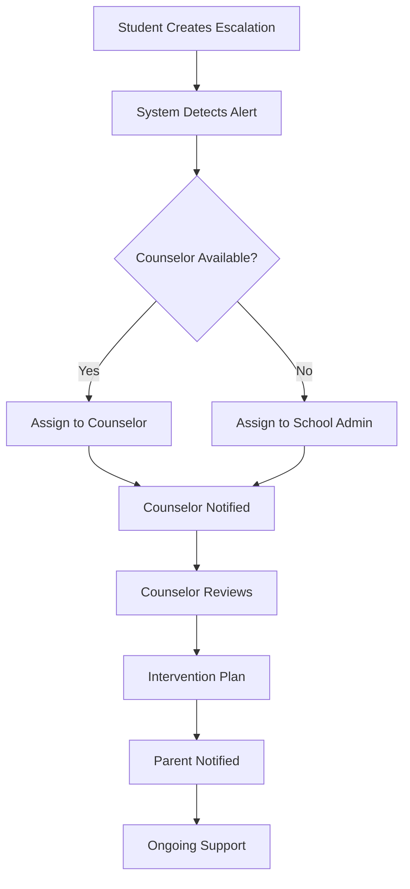
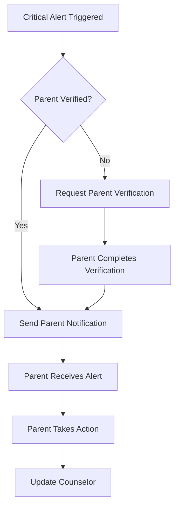

# 🎯 Version 2.0: Counselor & Parent Dashboard Permissions

## 📋 Overview

Version 2.0 introduces specialized dashboards and permission systems for **Counselors** and **Parents**, providing role-based access to student information with appropriate privacy and security controls.

---

## 🎭 New Role Structure

### Existing Roles (v1.0)
- **SUPERADMIN**: Full system access
- **ADMIN**: School management access  
- **STUDENT**: Personal access only

### New Roles (v2.0)
- **COUNSELOR**: Access to students with escalation alerts
- **PARENT**: Access to their own children only

---

## 🔐 Permission Matrix

| Feature                  | SA      | Admin     | Counselor      | Parent        | Student          |
|--------------------------|------------|---|--------|----------- |---------|---------|
| **Dashboard Access**     | ✅ All    | ✅ School | ✅ Alert Students | ✅ Own Children | ✅ Personal |
| **Student List**         | ✅ All | ✅ School | ⚠️ Alert Students Only | ⚠️ Own Children Only | ❌ |
| **Student Profiles**     | ✅ All | ✅ School | ⚠️ Alert Students Only | ⚠️ Own Children Only | ✅ Own |
| **Escalation Alerts**    | ✅ All | ✅ School | ✅ Assigned Students | ✅ Own Children | ❌ |
| **Chat Monitoring**      | ✅ All | ❌ | ⚠️ Alert Students Only | ⚠️ Own Children Only | ❌ |
| **Journal Access**       | ✅ All | ❌ | ⚠️ Alert Students Only | ⚠️ Own Children Only | ✅ Own |
| **Mood Check-ins**       | ✅ All | ✅ School | ⚠️ Alert Students Only | ⚠️ Own Children Only | ✅ Own |
| **Meditation Data**      | ✅ All | ✅ School | ⚠️ Alert Students Only | ⚠️ Own Children Only | ✅ Own |
| **Academic Info**        | ✅ All | ✅ School | ⚠️ Alert Students Only | ⚠️ Own Children Only | ✅ Own |
| **Parent Communication** | ✅ All | ✅ School | ✅ Assigned Students | ❌ | ❌ |

---

## 🎯 Counselor Permissions

### 📊 Scope of Access
- **Primary Focus**: Students with active escalation alerts
- **Secondary Access**: Historical data for students previously under care
- **No Access**: Students without escalation alerts (unless assigned)

### 🔍 Specific Permissions

#### Student Information
```typescript
// Can view students with escalation alerts
counselor.students.view.alerts_only

// Can view student profiles for alert students
counselor.profiles.view.assigned_students

// Can view escalation history
counselor.escalations.view.assigned_students
```

#### Communication Access
```typescript
// Can monitor chat for alert students
counselor.chat.monitor.assigned_students

// Can view journal entries (with consent)
counselor.journaling.view.assigned_students

// Can view mood patterns
counselor.mood.view.assigned_students
```

#### Intervention Tools
```typescript
// Can respond to escalations
counselor.escalations.respond.assigned_students

// Can create intervention plans
counselor.interventions.create.assigned_students

// Can schedule counseling sessions
counselor.sessions.schedule.assigned_students
```

### 🔄 Assignment Logic
```sql
-- Counselors are assigned to students based on:
1. Active escalation alerts
2. School/grade assignments
3. Specialization matching
4. Current caseload capacity
```

---

## 👨‍👩‍👧‍👦 Parent Permissions

### 📊 Scope of Access
- **Primary Focus**: Own children only
- **Verification Required**: Parent-child relationship verification
- **Limited Access**: Academic and wellness information only

### 🔍 Specific Permissions

#### Child Information
```typescript
// Can view own children's profiles
parent.children.view.own_children

// Can view academic progress
parent.academics.view.own_children

// Can view wellness overview
parent.wellness.view.own_children
```

#### Safety & Alerts
```typescript
// Receives critical alerts for own children
parent.alerts.receive.own_children

// Can view mood trends
parent.mood.view.own_children

// Can view journal summaries (not full entries)
parent.journaling.summary.own_children
```

#### Communication
```typescript
// Can communicate with counselors
parent.communication.counselors

// Can request appointments
parent.appointments.request.own_children

// Can provide consent for data sharing
parent.consent.manage.own_children
```

### 🔗 Parent-Child Verification
```sql
-- Parent-child relationships are verified through:
1. School enrollment records
2. Parent contact information
3. Verification codes sent to parents
4. School admin approval
```

---

## 🛡️ Security & Privacy Controls

### 🔒 Data Access Rules

#### Counselor Access
```typescript
// Only students with active escalations
const counselorStudents = await db.student.findMany({
  where: {
    schoolId: counselor.schoolId,
    escalationAlerts: {
      some: {
        status: 'ACTIVE',
        assignedCounselorId: counselor.id
      }
    }
  }
});
```

#### Parent Access
```typescript
// Only verified parent-child relationships
const parentChildren = await db.student.findMany({
  where: {
    parentAssignments: {
      some: {
        parentId: parent.id,
        status: 'VERIFIED'
      }
    }
  }
});
```

### 🚫 Restricted Access

#### Counselors Cannot Access:
- Students without escalation alerts (unless assigned)
- Full chat history (only relevant segments)
- Other counselors' caseloads
- Administrative functions

#### Parents Cannot Access:
- Other children's data
- Detailed therapy notes
- Other parents' information
- System administration

---

## 🏗️ Implementation Architecture

### 📱 Dashboard Components

#### Counselor Dashboard
```typescript
// src/components/counselor/CounselorDashboard.tsx
interface CounselorDashboard {
  activeCaseload: Student[];      // Students with active alerts
  escalationQueue: Alert[];       // Pending escalations
  scheduledSessions: Session[];   // Upcoming appointments
  wellnessMetrics: Metrics[];     // Caseload statistics
}
```

#### Parent Dashboard
```typescript
// src/components/parent/ParentDashboard.tsx
interface ParentDashboard {
  childrenOverview: Child[];      // Own children's status
  recentAlerts: Alert[];          // Critical alerts only
  academicProgress: Progress[];  // School performance
  wellnessSummary: Summary[];     // Mood/activity overview
}
```

### 🔐 Permission Middleware

#### Counselor Permissions
```typescript
// src/middleware/counselor-permissions.ts
export const withCounselorPermission = (
  requiredPermission: CounselorPermission
) => {
  return async (req: Request, res: Response, next: NextFunction) => {
    const counselor = await getCurrentCounselor(req);
    
    // Verify counselor has access to specific student
    if (req.params.studentId) {
      const hasAccess = await canAccessStudent(
        counselor.id, 
        req.params.studentId
      );
      
      if (!hasAccess) {
        return res.status(403).json({ 
          error: 'Access denied to student data' 
        });
      }
    }
    
    // Check specific permission
    if (!counselor.hasPermission(requiredPermission)) {
      return res.status(403).json({ 
        error: 'Insufficient permissions' 
      });
    }
    
    next();
  };
};
```

#### Parent Permissions
```typescript
// src/middleware/parent-permissions.ts
export const withParentPermission = (
  requiredPermission: ParentPermission
) => {
  return async (req: Request, res: Response, next: NextFunction) => {
    const parent = await getCurrentParent(req);
    
    // Verify parent-child relationship
    if (req.params.studentId) {
      const isParent = await isParentOfChild(
        parent.id, 
        req.params.studentId
      );
      
      if (!isParent) {
        return res.status(403).json({ 
          error: 'Access denied to student data' 
        });
      }
    }
    
    // Check specific permission
    if (!parent.hasPermission(requiredPermission)) {
      return res.status(403).json({ 
        error: 'Insufficient permissions' 
      });
    }
    
    next();
  };
};
```

---

## 🗄️ Database Schema Updates

### 👥 New Tables

#### Parent-Child Relationships
```sql
CREATE TABLE ParentChildRelationships (
  id UUID PRIMARY KEY DEFAULT gen_random_uuid(),
  parentId UUID REFERENCES Users(id),
  studentId UUID REFERENCES Users(id),
  relationshipType VARCHAR(50) NOT NULL, -- 'MOTHER', 'FATHER', 'GUARDIAN'
  status VARCHAR(20) DEFAULT 'PENDING',   -- 'PENDING', 'VERIFIED', 'REJECTED'
  verificationCode VARCHAR(10),
  verifiedAt TIMESTAMP,
  verifiedBy UUID REFERENCES Users(id),  -- School admin who verified
  createdAt TIMESTAMP DEFAULT NOW(),
  updatedAt TIMESTAMP DEFAULT NOW(),
  
  UNIQUE(parentId, studentId)
);
```

#### Counselor Assignments
```sql
CREATE TABLE CounselorAssignments (
  id UUID PRIMARY KEY DEFAULT gen_random_uuid(),
  counselorId UUID REFERENCES Users(id),
  studentId UUID REFERENCES Users(id),
  assignmentType VARCHAR(50) NOT NULL,   -- 'ESCALATION', 'ONGOING', 'PREVENTIVE'
  status VARCHAR(20) DEFAULT 'ACTIVE',   -- 'ACTIVE', 'INACTIVE', 'COMPLETED'
  assignedBy UUID REFERENCES Users(id),  -- Admin who assigned
  assignedAt TIMESTAMP DEFAULT NOW(),
  notes TEXT,
  
  UNIQUE(counselorId, studentId)
);
```

### 🔐 New Roles & Permissions

#### Counselor Role
```sql
INSERT INTO Roles (name, description) VALUES 
('COUNSELOR', 'School counselor with access to students requiring mental health support');

-- Counselor Permissions
INSERT INTO Permissions (name, module, description) VALUES 
('counselor.dashboard.view', 'DASHBOARD', 'View counselor dashboard'),
('counselor.students.view.alerts_only', 'STUDENTS', 'View students with escalation alerts'),
('counselor.profiles.view.assigned_students', 'PROFILES', 'View profiles of assigned students'),
('counselor.escalations.view.assigned_students', 'ESCALATIONS', 'View escalations for assigned students'),
('counselor.escalations.respond.assigned_students', 'ESCALATIONS', 'Respond to escalations for assigned students'),
('counselor.chat.monitor.assigned_students', 'CHAT', 'Monitor chat for assigned students'),
('counselor.journaling.view.assigned_students', 'JOURNALING', 'View journal entries for assigned students'),
('counselor.mood.view.assigned_students', 'MOOD', 'View mood data for assigned students'),
('counselor.interventions.create.assigned_students', 'INTERVENTIONS', 'Create intervention plans for assigned students'),
('counselor.sessions.schedule.assigned_students', 'SESSIONS', 'Schedule counseling sessions');
```

#### Parent Role
```sql
INSERT INTO Roles (name, description) VALUES 
('PARENT', 'Parent with access to their own children''s information');

-- Parent Permissions  
INSERT INTO Permissions (name, module, description) VALUES 
('parent.dashboard.view', 'DASHBOARD', 'View parent dashboard'),
('parent.children.view.own_children', 'CHILDREN', 'View own children''s profiles'),
('parent.academics.view.own_children', 'ACADEMICS', 'View academic progress of own children'),
('parent.wellness.view.own_children', 'WELLNESS', 'View wellness overview of own children'),
('parent.alerts.receive.own_children', 'ALERTS', 'Receive critical alerts for own children'),
('parent.mood.view.own_children', 'MOOD', 'View mood trends of own children'),
('parent.journaling.summary.own_children', 'JOURNALING', 'View journal summaries of own children'),
('parent.communication.counselors', 'COMMUNICATION', 'Communicate with counselors'),
('parent.appointments.request.own_children', 'APPOINTMENTS', 'Request appointments for own children'),
('parent.consent.manage.own_children', 'CONSENT', 'Manage consent for own children');
```

---

## 🚀 API Endpoints

### 👨‍⚕️ Counselor APIs

#### Dashboard & Caseload
```typescript
// GET /api/counselor/dashboard
// Returns counselor's dashboard with assigned students
export async function GET(request: Request) {
  const counselor = await getCurrentCounselor(request);
  
  const dashboard = {
    activeCaseload: await getAssignedStudents(counselor.id),
    pendingEscalations: await getPendingEscalations(counselor.id),
    scheduledSessions: await getUpcomingSessions(counselor.id),
    caseloadMetrics: await getCaseloadMetrics(counselor.id)
  };
  
  return Response.json(dashboard);
}

// GET /api/counselor/students/:studentId
// Returns student profile if counselor has access
export async function GET(
  request: Request, 
  { params }: { params: { studentId: string } }
) {
  const counselor = await getCurrentCounselor(request);
  
  // Verify access
  const hasAccess = await canAccessStudent(counselor.id, params.studentId);
  if (!hasAccess) {
    return Response.json({ error: 'Access denied' }, { status: 403 });
  }
  
  const student = await getStudentProfile(params.studentId);
  return Response.json(student);
}
```

#### Escalation Management
```typescript
// POST /api/counselor/escalations/:escalationId/respond
// Respond to escalation
export async function POST(
  request: Request,
  { params }: { params: { escalationId: string } }
) {
  const counselor = await getCurrentCounselor(request);
  const { response, action } = await request.json();
  
  // Verify counselor is assigned to this escalation
  const escalation = await getEscalation(params.escalationId);
  if (escalation.assignedCounselorId !== counselor.id) {
    return Response.json({ error: 'Access denied' }, { status: 403 });
  }
  
  const updatedEscalation = await respondToEscalation(
    params.escalationId,
    counselor.id,
    response,
    action
  );
  
  return Response.json(updatedEscalation);
}
```

### 👨‍👩‍👧‍👦 Parent APIs

#### Dashboard & Children
```typescript
// GET /api/parent/dashboard
// Returns parent's dashboard with their children
export async function GET(request: Request) {
  const parent = await getCurrentParent(request);
  
  const dashboard = {
    children: await getParentChildren(parent.id),
    recentAlerts: await getParentAlerts(parent.id),
    academicUpdates: await getAcademicUpdates(parent.id),
    wellnessOverview: await getWellnessOverview(parent.id)
  };
  
  return Response.json(dashboard);
}

// GET /api/parent/children/:studentId
// Returns child's information if parent is verified
export async function GET(
  request: Request,
  { params }: { params: { studentId: string } }
) {
  const parent = await getCurrentParent(request);
  
  // Verify parent-child relationship
  const isParent = await isParentOfChild(parent.id, params.studentId);
  if (!isParent) {
    return Response.json({ error: 'Access denied' }, { status: 403 });
  }
  
  const childInfo = await getChildInformation(params.studentId, 'parent');
  return Response.json(childInfo);
}
```

#### Communication & Appointments
```typescript
// POST /api/parent/communication/request
// Request to communicate with counselor
export async function POST(request: Request) {
  const parent = await getCurrentParent(request);
  const { studentId, message, urgency } = await request.json();
  
  // Verify parent-child relationship
  const isParent = await isParentOfChild(parent.id, studentId);
  if (!isParent) {
    return Response.json({ error: 'Access denied' }, { status: 403 });
  }
  
  const communication = await createCommunicationRequest({
    parentId: parent.id,
    studentId,
    message,
    urgency
  });
  
  return Response.json(communication);
}
```

---

## 🎨 UI Components

### 👨‍⚕️ Counselor Dashboard Components

#### Caseload Overview
```typescript
// src/components/counselor/CaseloadOverview.tsx
interface CaseloadOverviewProps {
  activeStudents: Student[];
  pendingEscalations: EscalationAlert[];
  upcomingSessions: CounselingSession[];
}

export function CaseloadOverview({ 
  activeStudents, 
  pendingEscalations, 
  upcomingSessions 
}: CaseloadOverviewProps) {
  return (
    <div className="grid grid-cols-1 md:grid-cols-3 gap-6">
      <Card>
        <CardHeader>
          <CardTitle>Active Caseload</CardTitle>
        </CardHeader>
        <CardContent>
          <div className="text-2xl font-bold">{activeStudents.length}</div>
          <p className="text-sm text-muted-foreground">Students requiring support</p>
        </CardContent>
      </Card>
      
      <Card>
        <CardHeader>
          <CardTitle>Pending Escalations</CardTitle>
        </CardHeader>
        <CardContent>
          <div className="text-2xl font-bold text-red-600">
            {pendingEscalations.length}
          </div>
          <p className="text-sm text-muted-foreground">Requiring immediate attention</p>
        </CardContent>
      </Card>
      
      <Card>
        <CardHeader>
          <CardTitle>Today's Sessions</CardTitle>
        </CardHeader>
        <CardContent>
          <div className="text-2xl font-bold text-green-600">
            {upcomingSessions.length}
          </div>
          <p className="text-sm text-muted-foreground">Scheduled appointments</p>
        </CardContent>
      </Card>
    </div>
  );
}
```

#### Student List (Alert-Based)
```typescript
// src/components/counselor/StudentList.tsx
export function StudentList() {
  const [students, setStudents] = useState<Student[]>([]);
  
  useEffect(() => {
    // Only fetch students with escalation alerts
    fetch('/api/counselor/students?filter=alerts_only')
      .then(res => res.json())
      .then(data => setStudents(data));
  }, []);

  return (
    <div className="space-y-4">
      {students.map(student => (
        <StudentCard 
          key={student.id} 
          student={student}
          showAlertStatus={true}
          showEscalationHistory={true}
        />
      ))}
    </div>
  );
}
```

### 👨‍👩‍👧‍👦 Parent Dashboard Components

#### Children Overview
```typescript
// src/components/parent/ChildrenOverview.tsx
export function ChildrenOverview() {
  const [children, setChildren] = useState<Child[]>([]);
  
  useEffect(() => {
    // Only fetch parent's own children
    fetch('/api/parent/children')
      .then(res => res.json())
      .then(data => setChildren(data));
  }, []);

  return (
    <div className="grid grid-cols-1 md:grid-cols-2 lg:grid-cols-3 gap-6">
      {children.map(child => (
        <ChildCard 
          key={child.id} 
          child={child}
          showAcademicStatus={true}
          showWellnessSummary={true}
          showAlerts={true}
        />
      ))}
    </div>
  );
}
```

#### Alert Notifications
```typescript
// src/components/parent/AlertNotifications.tsx
export function AlertNotifications() {
  const [alerts, setAlerts] = useState<Alert[]>([]);
  
  useEffect(() => {
    // Only fetch alerts for parent's children
    fetch('/api/parent/alerts')
      .then(res => res.json())
      .then(data => setAlerts(data));
  }, []);

  return (
    <div className="space-y-4">
      {alerts.map(alert => (
        <AlertCard 
          key={alert.id} 
          alert={alert}
          showActions={true}
          parentView={true}
        />
      ))}
    </div>
  );
}
```

---

## 🔄 Workflow Integration

### 🚨 Escalation Assignment Flow



### 👨‍👩‍👧‍👦 Parent Notification Flow



---

## 🧪 Testing Strategy

### 🧪 Permission Testing

#### Counselor Access Tests
```typescript
// src/test/counselor-permissions.test.ts
describe('Counselor Permissions', () => {
  test('should only access students with escalations', async () => {
    const counselor = await createTestCounselor();
    const studentWithAlert = await createTestStudentWithAlert();
    const studentWithoutAlert = await createTestStudent();
    
    // Should access student with alert
    const response1 = await request(app)
      .get(`/api/counselor/students/${studentWithAlert.id}`)
      .set('Authorization', `Bearer ${counselor.token}`)
      .expect(200);
    
    // Should NOT access student without alert
    const response2 = await request(app)
      .get(`/api/counselor/students/${studentWithoutAlert.id}`)
      .set('Authorization', `Bearer ${counselor.token}`)
      .expect(403);
  });
});
```

#### Parent Access Tests
```typescript
// src/test/parent-permissions.test.ts
describe('Parent Permissions', () => {
  test('should only access own children', async () => {
    const parent = await createTestParent();
    const ownChild = await createTestChild(parent.id);
    const otherChild = await createTestChild();
    
    // Should access own child
    const response1 = await request(app)
      .get(`/api/parent/children/${ownChild.id}`)
      .set('Authorization', `Bearer ${parent.token}`)
      .expect(200);
    
    // Should NOT access other child
    const response2 = await request(app)
      .get(`/api/parent/children/${otherChild.id}`)
      .set('Authorization', `Bearer ${parent.token}`)
      .expect(403);
  });
});
```

---

## 📊 Migration Guide

### 🔄 Database Migration

```sql
-- Step 1: Add new roles
INSERT INTO Roles (name, description) VALUES 
('COUNSELOR', 'School counselor with access to students requiring mental health support'),
('PARENT', 'Parent with access to their own children''s information');

-- Step 2: Add permissions (see full list above)
-- ... (permission inserts)

-- Step 3: Assign permissions to roles
-- ... (role-permission assignments)

-- Step 4: Create parent-child relationship table
-- ... (table creation)

-- Step 5: Create counselor assignment table
-- ... (table creation)

-- Step 6: Migrate existing users to new roles if needed
-- ... (data migration)
```

### 🔄 Code Migration

```typescript
// Step 1: Update role enums
export enum UserRole {
  SUPERADMIN = 'SUPERADMIN',
  ADMIN = 'ADMIN',
  COUNSELOR = 'COUNSELOR',  // New
  PARENT = 'PARENT',        // New
  STUDENT = 'STUDENT'
}

// Step 2: Add new permission types
export interface CounselorPermissions {
  canViewAssignedStudents: boolean;
  canRespondToEscalations: boolean;
  canMonitorAssignedChats: boolean;
  // ... other counselor permissions
}

export interface ParentPermissions {
  canViewOwnChildren: boolean;
  canReceiveChildAlerts: boolean;
  canCommunicateWithCounselors: boolean;
  // ... other parent permissions
}

// Step 3: Update middleware
// ... (add counselor and parent middleware)
```

---

## 🎯 Success Metrics

### 📈 Key Performance Indicators

#### Counselor Dashboard
- **Caseload Efficiency**: Average time per student intervention
- **Escalation Response Time**: Time from alert to counselor response
- **Student Outcomes**: Improvement in student wellness metrics
- **Parent Satisfaction**: Feedback on counselor communication

#### Parent Dashboard
- **Parent Engagement**: Frequency of dashboard usage
- **Alert Response Rate**: Parent response to critical alerts
- **Communication Quality**: Satisfaction with counselor interactions
- **Child Wellness**: Impact on student outcomes

### 🔍 Privacy & Security Metrics
- **Zero Data Breaches**: No unauthorized access incidents
- **Permission Accuracy**: 100% correct access control enforcement
- **Audit Trail**: Complete logging of all data access
- **Compliance**: Full adherence to privacy regulations

---

## 🚀 Next Steps

### 🎯 Phase 1: Foundation (Week 1-2)
- [ ] Update database schema with new roles and tables
- [ ] Implement basic permission middleware
- [ ] Create counselor and parent authentication flows
- [ ] Set up basic dashboard components

### 🎯 Phase 2: Core Features (Week 3-4)
- [ ] Implement counselor student assignment logic
- [ ] Build parent-child verification system
- [ ] Create escalation assignment workflows
- [ ] Develop dashboard analytics

### 🎯 Phase 3: Integration (Week 5-6)
- [ ] Integrate with existing escalation system
- [ ] Connect to notification system
- [ ] Implement communication tools
- [ ] Add comprehensive testing

### 🎯 Phase 4: Launch (Week 7-8)
- [ ] User acceptance testing
- [ ] Security audit
- [ ] Performance optimization
- [ ] Production deployment

---

## 📞 Support & Documentation

### 📚 Additional Resources
- [API Documentation](./API_DOCUMENTATION.md)
- [Security Guidelines](./SECURITY_GUIDELINES.md)
- [Testing Procedures](./TESTING_PROCEDURES.md)
- [Troubleshooting Guide](./TROUBLESHOOTING.md)

### 🆘 Support Contacts
- **Technical Support**: tech-support@psychologybuddy.com
- **Security Issues**: security@psychologybuddy.com
- **Feature Requests**: features@psychologybuddy.com

---

## 📄 License & Compliance

This permission system is designed to comply with:
- **FERPA** (Family Educational Rights and Privacy Act)
- **HIPAA** (Health Insurance Portability and Accountability Act)
- **COPPA** (Children's Online Privacy Protection Act)
- **GDPR** (General Data Protection Regulation) where applicable

All data access is logged, audited, and subject to regular security reviews to ensure compliance and protect student privacy.

---

**Version 2.0 represents a significant advancement in providing specialized, role-based access to student mental health information while maintaining the highest standards of privacy and security.**
